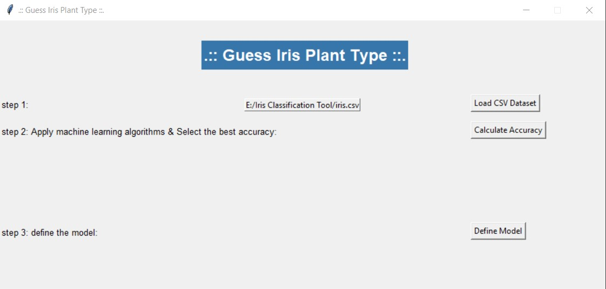

# Iris-Plant-Dataset-Classification-Tool-Using-Machine-Learning-Algorithms-And-Tkinter-GUI
A simple machine learning tool uses Tkinter GUI to classify the Iris plant dataset and guess the iris class using machine learning algorithms.

# The Machine Learning algorithms used in this project are:

  1- Support vector machine (SVM).
  
  2- Random Forest Classifier (RFC).
  
  3- K-Nearest Neighbors (KNN).
  
  
  # How does the tool work?
  
  The working process of this tool goes through three steps as follow:
  
  # step 1: 
  choose the iris dataset file by hitting the (Load CSV Dataset) button, then choose the file from the file browsing dialog that appears.
  
  

